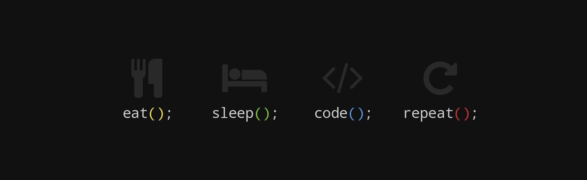

<h1 align="center">
    
</h1>
<h3 align="center">Coding is learned by writing code...</h3>

 
  
  
  <a href="https://instagram.com/mevlut_akf_" target="_blank">
      <!-- sqlite, safari, google-chrome are other good icon options -->
  </a>

 

<h2 align="center">⚒️ Languages-Frameworks-Tools ⚒️</h2>
 

                          

 

  <h2>🐍 My Contributions 🐍</h2>

  

<h2 align="center">⚡ Stats ⚡</h2>
 

  
  
   
  

 

